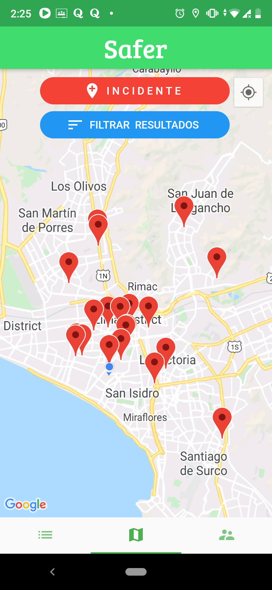
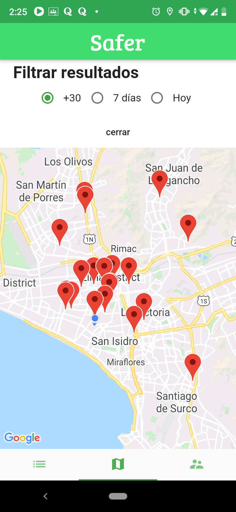
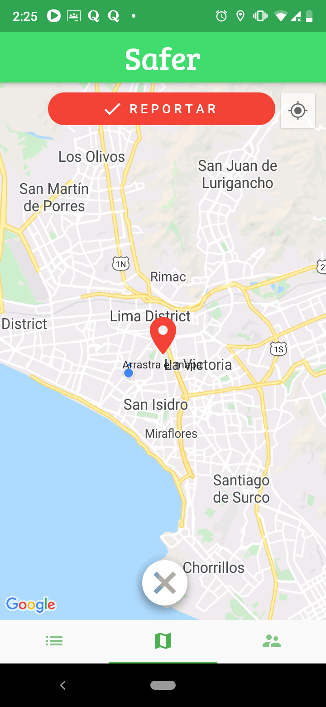
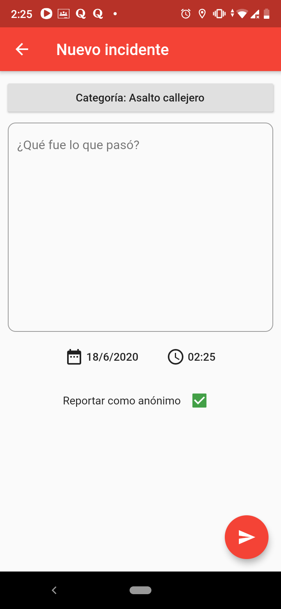
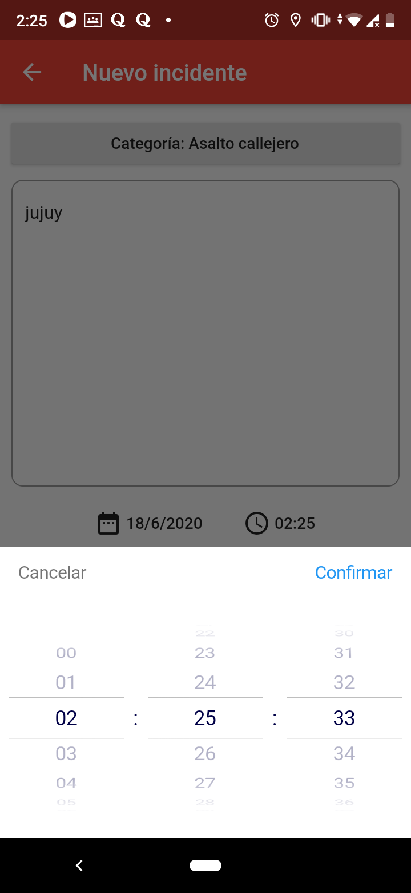
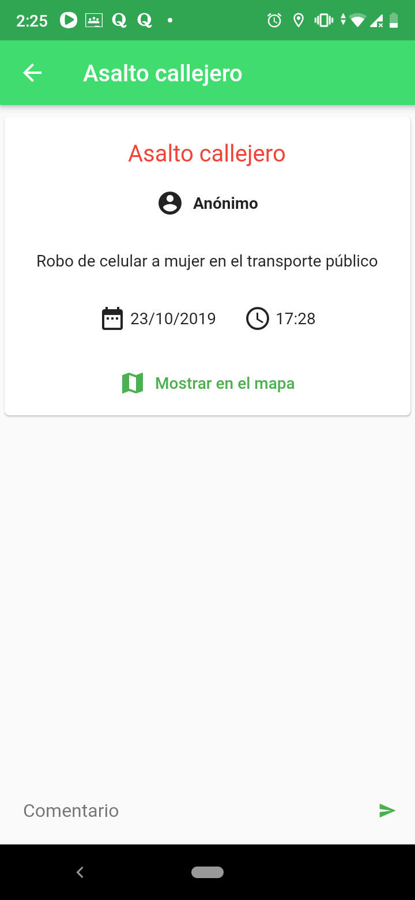
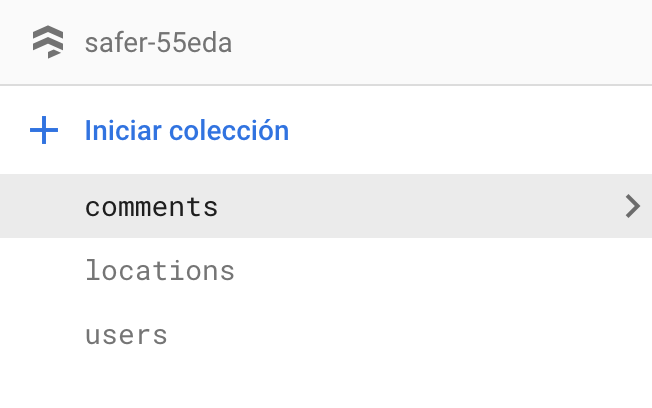
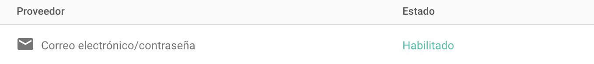

# Safer
Una app de seguridad ciudadana para el reporte de incidentes hecha en Flutter con la ayuda del package de Google Maps. Su principal funcionalidad es la publicación y actualización de marcadores (incidentes) en tiempo real usando Firestore.

A mobile city security app for reporting incidents made with Flutter and the Google Maps package. It's core function is to publish an update markers (incidents) in realtime using Firestore. 

    

## Getting Started
Ciertas configuraciones previas son necesarias para poder correr la app. 

### Firebase
Este repo no incluye ninguno de los archivos de configuración de Firebase. Es necesario que habilites el apartado de Authentication en  Firebase para Email. Además debes crear 3 colecciones en tu Cloud Firestore (comments,locations,users)

### Google Maps
Necesitas generar una apikey de Google Maps y configurar en Android como IOS si ese es el caso. Checkea el siguiente [tutorial de Google Maps en flutter](https://medium.com/comunidad-flutter/google-maps-en-flutter-98bedecb528b)
